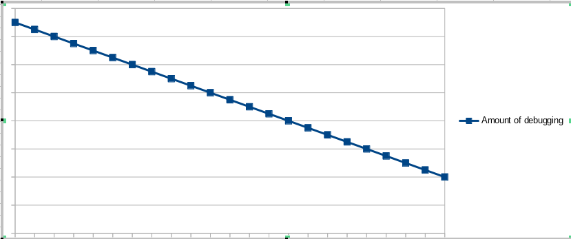
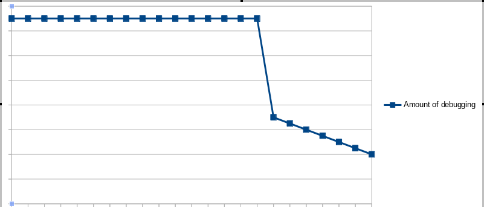
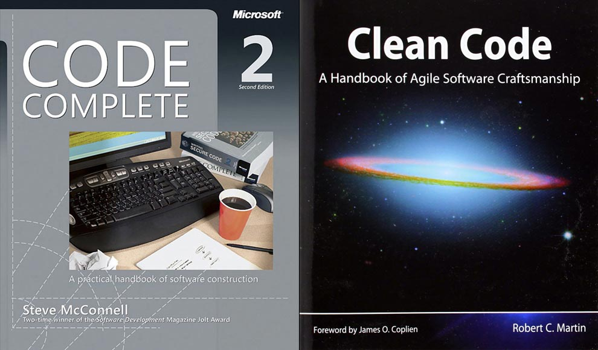
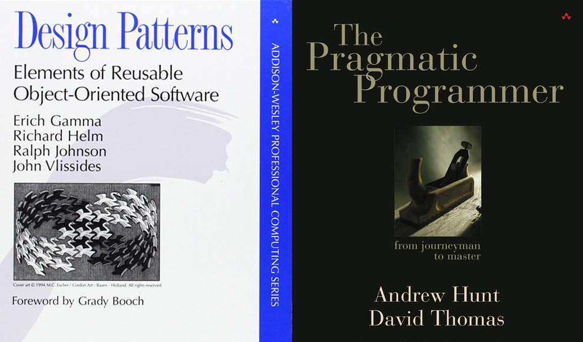

# Introduction

## Motivation
### What debugger do you use?
"I just use print statements" -Dave Kimura 

[comment]: <> (Dave is a cood developer)

## Scope
Will not include debugging production errors
Will will include debugging development errors

# Who am I? 
## MCIEA

## LunarVim

# Why I code
## The mythical man-month
"The programmer, like the poet, works only slightly removed from pure thought-stuff. He builds his castles in the air, from air, creating by exertion of the imagination. Few media of creation are so flexible, so easy to polish and rework, so readily capable of realizing grand conceptual structures." --Frederick Brooks

## The gap in expertise 
"All of us who do creative work, we get into it because we have good taste. But there is this gap. For the first couple years you make stuff, it’s just not that good. It’s trying to be good, it has potential, but it’s not. But your taste, the thing that got you into the game, is still killer. And your taste is why your work disappoints you. A lot of people never get past this phase, they quit. Most people I know who do interesting, creative work went through years of this. We know our work doesn’t have this special thing that we want it to have. We all go through this. And if you are just starting out or you are still in this phase, you gotta know its normal and the most important thing you can do is do a lot of work." -Ira Glass

# Learning how to debug less
## With more experience, I debug less

## The growth isn't always linear 

## Amount of time spent debugging
### The mythical man month, 1975
The author finds that, no matter what the intention or plan was, half of total project time is spend testing and debugging. So, rather than ‘falling behind schedule’, they build it into their plans. 

### Fallacies of Software Engineering
"The data on the percentage of time spent in error removal has varied over the years, but the usual figures are 20-20-20-40. That is, 20 percent for requirements, 20 percent for design, 20 percent for coding (intuition suggests to most programmers that here is where the time is spent, but intuition is very wrong), and 40 percent for error removal." --Robert L Glass, 2003

## There are specific, actionable steps to shorten the gap

### Make small changes

### Write code that's easy to reason about

### Keep a mental model of the problem

### Make abstract concepts concrete

### When you discover a gap in understanding, reach for solutions that help complete your mental model

## Read the classics

### Code Complete, Clean Code

## More classics

### The Pragmatic Programmer, Design Patterns

## Learn your tools

### use --help
rails g model --help

### read documentation
:cheat readline
:!ri Range.to_a
:DevDocs
google it

## Rubber duck debugging

## Stop coding / go for a walk. / Go to sleep

## Proofread your code

## Readline shortcuts in vim, irb, and terminal emulator

## Pair programming

## Proofread

## TDD / small changes

## Code is very abstract.  Make it concrete.  

### Write things down

### Examine code in a REPL
xpath in javascript console

## Learn the debugging tools

### Frontend debugging
    Web console.  debug gem. pry, byebug.  Debug adapter protocol.  rails c --sandbox.  Visual studio code.  RubyMine
    Marginalia gem, better errors

## Static analysis tools
  Rubocop, reek - refactoring martin fowler
  Refactoring your code will help you keep your classes small and maintainable and also easier to reason about.

## debug.rb
rdbg --open=chrome

open the gem to view the source code
gem open rspec

Does a github issue exist?
